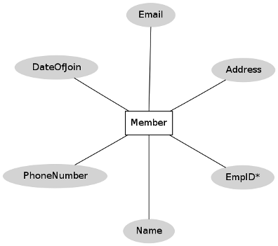
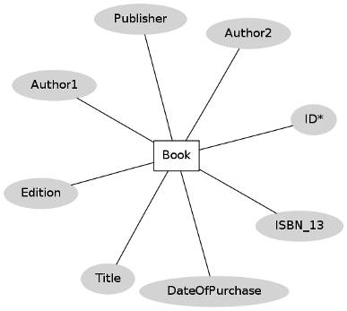
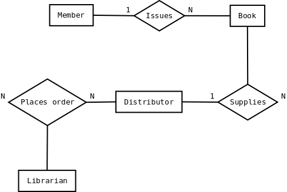

## Case Study

**1. A Library Information System for SE VLabs Institute**

The SE VLabs Institute has been recently setup to provide state-of-the-art research facilities in the field of Software Engineering. Apart from research scholars (students) and professors, it also includes quite a large number of employees who work on different projects undertaken by the institution.

As the size and capacity of the institute is increasing with the time, it has been proposed to develop a Library Information System (LIS) for the benefit of students and employees of the institute. LIS will enable the members to borrow a book (or return it) with ease while sitting at his desk/chamber. The system also enables a member to extend the date of his borrowing if no other booking for that particular book has been made. For the library staff, this system aids them to easily handle day-to-day book transactions. The librarian, who has administrative privileges and complete control over the system, can enter a new record into the system when a new book has been purchased, or remove a record in case any book is taken off the shelf. Any non-member is free to use this system to browse/search books online. However, issuing or returning books is restricted to valid users (members) of LIS only.

The final deliverable would a web application (using the recent HTML 5), which should run only within the institute LAN. Although this reduces security risk of the software to a large extent, care should be taken no confidential information (eg., passwords) is stored in plain text.

A robust database backend is essential for a high-quality information system. Database schema should be efficiently modeled, refined, and normalized. In this section we would develop a simple ER model for the Library Information System.

The first step towards ER modeling is to identify the set of relevant entities from the given problem statement. The two primary, and obvious, entity sets in this context are "Member" and "Book". The entity set "Member" represents all students, professors, or employees who have registered themselves with the LIS. While registering with the LIS one has to furnish a lot of personal and professional information. This typically includes name (well, that is trivial), employee ID (roll # for students), email address, phone #, age, date of joining in this institute. The system may store some not-so-important information as well like, blood group, marital status, and so on. All these pieces of information that an user has to provide are sufficient to describe a particular member. These characteristics are the attributes of the entities belonging to the entity set "Member".

It is essential for an entity to have one or more attributes that help us to distinguish it from another entity. 'Name' can't help that -- two persons could have exactly the same name. However, ('Name', 'Phone #') combination seems to be okay. No two persons can have the same phone number. 'Employee ID', 'Email address' are other potential candidates. Here, 'Employee ID', 'Email address' and ('Name', 'Phone #') are super keys. We choose 'Employee ID' to uniquely identify an user in our implementation. So, 'Employee ID' becomes our primary key (PK) for the "Member" entity set. Figure 3 represents this set along with it's attributes and the primary key.

Figure 3:  "Member" entity set

Let us now focus on the "Book" entity set. Typical attributes of a book are it's title, name of author(s), publisher, date of publication, edition, language, ISBN-10, ISBN-13, price (of course!), date of purchase. The set of listed attributes for a book doesn't give a straight forward choice of primary key. For instance, several books could have the same title. Again, ISBN numbers for a book are specific to it's edition -- it can't distinguish between two books of the same edition. One might be tempted to use a combination of ('Title', 'Authors') as a primary key. This has some shortcomings. It is advisable not to use texts as a PK. Moreover, the number of authors that a book could have is not fixed, although it is a small, finite number. The rules of normalization (not covered here) would dictate to have a separate field for each author like 'Author1', 'Author2', and so on. Therefore, we assign an extra attribute, 'ID', to each book as it's PK. Different databases available in the market provide mechanisms to generate such an unique ID, and automatically increment it whenever a new new entity is added. In fact, we could assign such an ID to the "Member" entity set as well. However, because of availability of the unique 'Employee ID' field, we skipped that. A graphical representation of the "Book" entity set is shown in figure 4.

Figure 4: "Book" entity set

One point to note here is that a book is likely to have multiple copies in the library. Therefore, one might wish to have a '# of copies' attribute for the "Book" entity set. However, that won't allow us to differentiate among the different copies of book bearing same title by same author(s), edition, and publisher. The approach that we have taken is to uniquely identify each book even though they are copies of the same title.

To buy any new book an order is to be placed to the distributor. This task is done by the librarian. Therefore, "Librarian" and "Distributor" are two other entities playing roles in this system.

Having identified the key entities, we could now relate them with each other. Let us consider the entity sets "Member" and "Book". A member can issue books. In fact, he can issue multiple books up to a finite number say, N. A particular book, however, could be issued by a single member only. Therefore, we have a one-to-many mapping from "Member" to "Book" entity sets. This relationship between "Member" and "Book" entity sets is pictorially depicted in figure 5.

Figure 5: Relationships among different entity sets

Figure 5 also shows that the librarian can "place order" for books to the distributor. This is a many-to-many mapping since a librarian can purchase books from multiple distributors. Also, if the institute has more than one librarians (or any other staff having such authority), then each of them could place order to the same distributor. An order is termed as complete when distributor supplies the book(s) and invoice.

The design in figure 3 has a flaw. Librarian himself could be a member of the LIS. However, he is a "special" kind of member since he can place order for books. Our ER diagram doesn't reflect this scenario. Such special roles of an entity set could be represented using "ISA" relationship, which is not discussed here.

Any kind of designing couldn't be possibly done at one go. Therefore, the baseline ER model so prepared should be revised by considering the business model yet again to ensure that all necessary information could be captured. Once this has been finalized, the next logical step would be to create table structures for each identified entity set (and relationships in some cases) and normalize the relations.