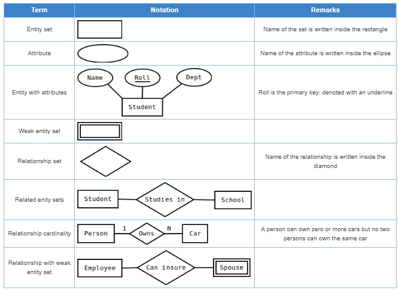
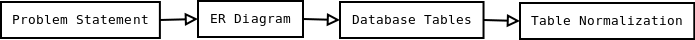

## Objectives

**After completing this experiment you will be able to:**

- Identify entity sets, their attributes, and various relationships
- Represent the data model through ER diagram

## Theory

### Entity Relationship Model
Entity-Relationship model is used to represent a logical design of a database to be created. In ER model, real world objects (or concepts) are abstracted as entities, and different possible associations among them are modeled as relationships.

For example, student and school -- they are two entities. Students study in school. So, these two entities are associated with a relationship "Studies in".

As another example, consider a system where some job runs every night, which updates the database. Here, job and database could be two entities. They are associated with the relationship "Updates".

#### Entity Set and Relationship Set

An entity set is a collection of all similar entities. For example, "Student" is an entity set that abstracts all students. Ram, John are specific entities belonging to this set. Similarly, a "Relationship" set is a set of similar relationships.

#### Attributes of Entity
Attributes are the characteristics describing any entity belonging to an entity set. Any entity in a set can be described by zero or more attributes.

For example, any student has got a name, age, an address. At any given time a student can study only at one school. In the school he would have a roll number, and of course a grade in which he studies. These data are the attributes of the entity set Student.

#### Keys

One or more attribute(s) of an entity set can be used to define the following keys:

- **Super key:** One or more attributes, which when taken together, helps to uniquely identify an entity in an entity set. For example, a school can have any number of students. However, if we know grade and roll number, then we can uniquely identify a student in that school.
- **Candidate key:** It is a minimal subset of a super key. In other words, a super key might contain extraneous attributes, which do not help in identifying an object uniquely. When such attributes are removed, the key formed so is called a candidate key.
- **Primary key:** A database might have more than one candidate key. Any candidate key chosen for a particular implementation of the database is called a primary key.
Prime attribute: Any attribute taking part in a super key

#### Weak Entity
An entity set is said to be weak if it is dependent upon another entity set. A weak entity can't be uniquely identified only by it's attributes. In other words, it doesn't have a super key.

For example, consider a company that allows employees to have travel allowance for their immediate family. So, here we have two entity sets: employee and family, related by "Can claim for". However, family doesn't have a super key. Existence of a family is entirely dependent on the concerned employee. So, it is meaningful only with reference to employee.

### Entity Generalization and Specialization
Once we have identified the entity sets, we might find some similarities among them. For example, multiple person interacts with a banking system. Most of them are customers, and rest employees or other service providers. Here, customers, employees are persons, but with certain specializations. Or in other way, person is the generalized form of customer and employee entity sets.

ER model uses the "ISA" hierarchy to depict specialization (and thus, generalization).

#### Mapping Cardinalities
One of the main tasks of ER modeling is to associate different entity sets. Let's consider two entity sets E1 and E2 associated by a relationship set R. Based on the number of entities in E1 and E2 are associated with, we can have the following four type of mappings:

- **One to one:** An entity in E1 is related to at most a single entity in E2, and vice versa
- **One to many:** An entity in E1 could be related to zero or more entities in E2. Any entity in E2 could be related to at most a single entity in E1.
- **Many to one:** Zero or more number of entities in E1 could be associated to a single entity in E2. However, an entity in E2 could be related to at most one entity in E1.
- **Many to many:** Any number of entities could be related to any number of entities in E2, including zero, and vice versa.

## ER Diagram
From a given problem statement we identify the possible entity sets, their attributes, and relationships among different entity sets. Once we have these information, we represent them pictorially, called an entity-relationship (ER) diagram.

### Graphical Notations for ER Diagram

Figure - 1: Include relationship between use cases

#### Importance of ER modeling
Figure - 2 shows the different steps involved in implementation of a (relational) database.

Figure - 2: Steps to implement a RDBMS

Given a problem statement, the first step is to identify the entities, attributes and relationships. We represent them using an ER diagram. Using this ER diagram, table structures are created, along with required constraints. Finally, these tables are normalized in order to remove redundancy and maintain data integrity. Thus, to have data stored efficiently, the ER diagram is to be drawn as much detailed and accurate as possible.

